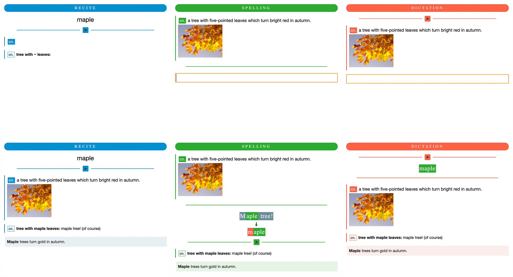

Maple Anki Template
===================



* Three main types of cards: Recite, Spelling, and Dictation, with flexible combinations
* Extensible fields specialized for vocabulary learning
* Beautifully optimized for macOS and iOS Anki (contributions for other platforms are welcomed!)
* Built-in support for audio
* Built-in support for parts of speech (POS)
* Built-in support for auto highlighting in examples
* Light and dark modes supported

## Getting Started
Go ahead and load the sample deck: [MapleTemplate.apkg](MapleTemplate.apkg). Enjoy!

There are suspended cards in the deck showing detailed instructions about the usage of the card. Don't miss them!

## Design
The template design was initially borrowed from [Leaflyer](https://leaflyer.lofter.com/post/4798b6_a4492e3) with a lot of rewriting.
Many functionalities of POS comes from the original template.
Thank you to all those contribute to the Anki community!

## Supported Platforms
For now the templates are optimized for macOS and iOS Anki. 
The template itself should work on the other platform (they are just HTML/CSS) but may not display properly. 
Contributions for other platforms are welcomed!

## Development
As there are multiple reused components in cards, templates are generated using EJS.
```shell
npm install
npm render
```

Outputs are files in `output` directory plus shared.css.
